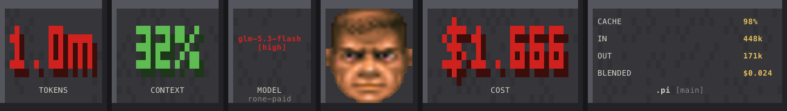

# Pi Doom HUD

Doom-style status bar for the [Pi Coding Agent](pi.dev). It features Doom Guy who's face gets more damaged as the context window fills up. The status bar also includes useful stats driven from live session usage.



## Install

```bash
pi install npm:pi-doom-hud
```

Restart or reload Pi. The HUD prefers the high-resolution image face by default when Pi reports image support. If it is unavailable, blurry, or leaves stale images, run `/doomhud text` to switch to the reliable quadrant-block fallback at lower resolution.

## Panels

| Panel | Shows |
|-------|-------|
| TOKENS | The model's context window, the capacity CONTEXT is measured against. |
| CONTEXT | Context usage as a percentage of the window. Green below 70%, amber at 70%, red at 90%+. |
| MODEL | The model id with the thinking level underneath and the provider as a caption. |
| FACE | The Doom Guy. Health is `100 - context usage`, mapped onto the five classic health tiers. |
| COST | Session spend in USD to three decimals, including compaction, branch-summary, and subagent spend. |
| CACHE / IN / OUT / BLENDED | Prompt-cache hit rate, fresh input tokens, output tokens, and mean spend per million billed tokens for in-session calls. Includes the current directory and git branch as a title. |

The tiles have their own size constraints so in smaller terminals, the tile with the most extra space will begin to compact first. This ensures as much data as possible is always visible.

## Doom Guy

The Doom Guy face is rendered as an image using the Kitty graphics protocol. In order to be displayed, it this protocol must be supported in your terminal and environment. When not available there is a block art style face that can be used, at a much lower resolution.

The following terminals are known to support the Kitty image protocol:
* Kitty
* iTerm2
* Ghostty
* WezTerm
* Warp

The extension works everywhere. The quadrant-block face is the universal fallback and is covered
by automated rendering tests. When Pi reports an image-capable terminal, the HUD tries the
high-resolution face first. If it does not load correctly, run `/doomhud text`. On some terminals there is the possibility of flickering of the image based on how the terminal renders images.

## Commands

- `/doomhud` — Toggle the HUD on and off
- `/doomhud image` — Use the high-resolution image face
- `/doomhud text` — Use the quadrant-block face
- `/doomhud <0-100>` — Set Doom Guy's health; it affects only the face and clears when the context token count changes
- `/doomhud natural` — Clear a test-health override immediately

## Compatibility

- **Pi**: requires pi 0.84.1 or newer and Node 22.19+. 
- **[pi-subagents](https://www.npmjs.com/package/pi-subagents)**: Optional. When installed, subagent spend is read from its session artifacts so COST includes children.

## How Cost is Evaluated

Cost usage is summed using Pi's stable usage fields (`input`, `output`, `cacheRead`, `cacheWrite`, and `cost.total`), plus usage entries, compaction calls, and branch-summary calls when those entries provide usage. Missing optional usage is treated as zero. The HUD does not depend on provider-specific pricing fields. Subagent children are separate pi processes whose spend never reaches this session's entries, so their cost is read from the `subagent-artifacts` directory pi-subagents writes next to the session file, cached per run and resolved asynchronously.

## Development

```bash
npm install
npm run typecheck
npm test                                          
npm run preview                                  
npx tsx scripts/preview.ts 140 tier5_left out.ppm 95
```

## Known Limitations

- The bar needs 60 columns. Below that it stands down rather than spill. The stats tile is also dropped below roughly 118 columns, since its four values would not fit.
- CONTEXT and COST read dim or zero immediately after startup or a compaction, until the next response lands. That is the data, not a bug.
- BLENDED is dominated by cache reads, so it is not comparable to sticker input/output prices.
- Subagent cost trails the first paint while artifacts are read.