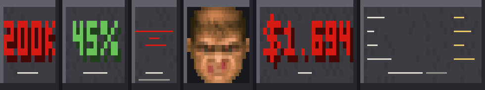
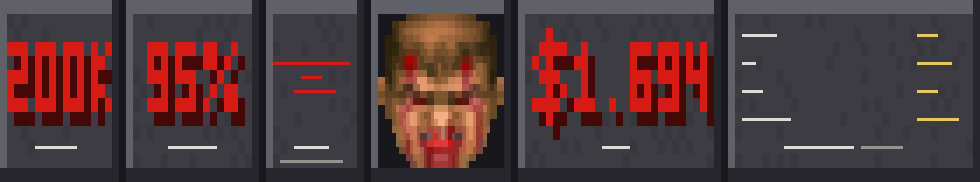

# Pi Doom HUD

A Doom-style status bar for the [Pi coding agent](https://github.com/badlogic/pi-mono/): beveled steel panels, red bitmap digits, and an animated Doom Guy face that degrades as your context window fills up.



The bar is a single widget rendered directly below the prompt box. Every reading on it comes from the live session: context usage, the model's context window, session cost, token economics, and subagent spend. The face in the middle is the classic Doom health-face sprite sheet, cropped, keyed, and re-rendered per frame.

## Install

```bash
pi install npm:pi-doom-hud
```

Restart Pi after installation. The HUD starts on by default.

## What the panels show

```
[ TOKENS 200k ] [ CONTEXT 45% ] [ MODEL claude-opus-4-5 ] [ FACE ] [ COST $1.694 ] [ CACHE  98% ]
                                                                                [ IN   18.4k ]
                                                                                [ OUT   534 ]
                                                                                [ BLENDED $1.203 ]
```

| Panel | Meaning |
|-------|---------|
| TOKENS | The model's context window in tokens. This is the capacity the CONTEXT percentage is measured against. |
| CONTEXT | Context usage as a percentage of the window. Green below 70%, amber at 70%, red at 90% and up, dim when there is no reading (right after a compaction, before the next response). |
| MODEL | The model id, broken on `-` onto as many lines as the panel needs, with the thinking level underneath and the provider as a caption. |
| FACE | The Doom Guy. Health is `100 - context usage`, mapped onto the five classic health tiers. He glances left and right on a random walk, glares occasionally, and shows the dead face while a compaction is running. |
| COST | Session spend in USD to three decimals. Includes assistant and tool-result usage, compaction and branch-summary calls, and subagent spend resolved from [pi-subagents](https://www.npmjs.com/package/pi-subagents) artifacts, so it matches Pi's own footer. |
| CACHE | Prompt-cache hit rate: the share of the prompt served from cache. |
| IN / OUT | Fresh input tokens and output tokens for the session. |
| BLENDED | Total spend divided by every billed token, in dollars per million tokens. This sits far below sticker prices because cache reads typically cost a twentieth of input. |

The bottom caption on the last tile shows the current directory and git branch. The branch is re-checked every 30 seconds, so switching branches shows up without a restart.

## The face

| | |
|---|---|
|  |  |
| `tier1`, 12% context | `tier5`, 95% context |

There is no separate "fresh" face. An empty context is full health, so a new session shows the healthiest tier and animates like any other healthy session.

### Pixel face vs block face

On terminals with inline-image support the face is the real sprite, one single-row image per bar row. That one-image-per-row trick is what makes it work: pi-tui repaints the bar line by line, and a face spanning 13 rows would get striped and clipped as digit panels sharing its rows are erased. A one-cell-tall image is just a normal line to pi-tui, so repainting a row redraws that row's slice and nothing can carve holes in the face.

| Terminal | Face rendering |
|----------|----------------|
| Kitty, Ghostty | Pixel face (Kitty graphics protocol) |
| iTerm2 | Pixel face (iTerm2 inline images) |
| WezTerm | Pixel face (iTerm2 escape) |
| Everything else | Quadrant-block fallback |

The fallback renders each character cell as a 2x2 subpixel grid using Unicode quadrant blocks rather than braille. Braille dots are tiny in fonts that substitute them, which washes the face out; quadrants exist in every terminal font and fill their subpixels solidly. 24-bit truecolor is required for the steel-and-red palette either way.

## Commands

- `/doomhud` - toggle the HUD on and off
- `/doomhud image` - force the pixel face (warns if the terminal has no inline-image support)
- `/doomhud text` - force the quadrant-block face

## Environment variables

- `DOOM_HUD_IMAGE=0` - start with the block face instead of the pixel face
- `DOOM_HUD_SLICE_SCALE=2` - encode face slices at 2x. On a 2x display, if the terminal upscales the slices and the eye detail smears, set this so the terminal downscales instead.

## Compatibility

- **Pi**: built against the extension API and tested with pi 0.84.x and 0.87.x. It uses `ctx.ui.setWidget` (belowEditor placement), `ctx.getContextUsage()`, session entries, the `session_before_compact` / `session_compact` / `session_compact_failed` events, and `pi.registerCommand`.
- **[pi-subagents](https://www.npmjs.com/package/pi-subagents)**: optional. When installed, subagent spend is read from its session artifacts so COST includes children. Without it the HUD works fine and COST just covers this session.
- **Terminals**: any modern terminal for the block face; Kitty-protocol or iTerm2 inline images for the pixel face. No inline images and no truecolor? You will get a degraded but working bar.

## How cost is counted

Every assistant message's usage lands in the session entries, and the HUD sums `input`, `output`, `cacheRead`, and `cacheWrite` from each one, plus `cost.total`. Compaction and branch-summary calls are billed too, so they are counted. Subagent children run as separate pi processes, so their spend never appears in this session's entries; the HUD reads it from the `subagent-artifacts` directory pi-subagents writes next to the session file, cached per run and resolved asynchronously so the COST panel converges with Pi's footer a moment after the first paint.

## Development

```bash
npm install
npm run typecheck
npm run preview                                   # /tmp/hud_preview.ppm
npx tsx scripts/preview.ts 140 tier5_left out.ppm 95
```

`scripts/preview.ts` rasterizes the bar (block face) to a PPM so layout changes can be eyeballed without a terminal. Any image viewer that reads PPM works; convert with ImageMagick or `sips` if needed.

## Known limitations

- The pixel face needs 24-bit truecolor plus inline images; block glyphs otherwise.
- CONTEXT and COST read dim or zero right after startup or a compaction, until the next response lands. That is the data, not a bug.
- BLENDED is dominated by cache reads, so it is not comparable to sticker input/output prices.
- Subagent cost converges asynchronously; it can trail the first paint by a second or two.
